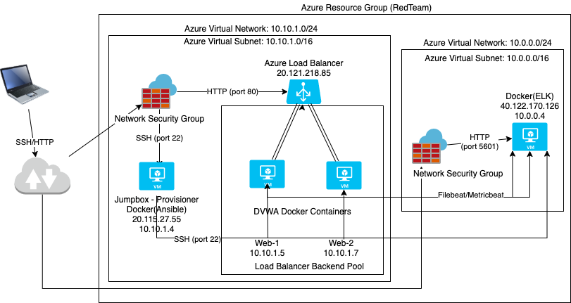
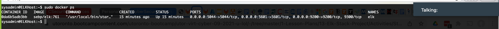

## Automated ELK Stack Deployment

The files in this repository were used to configure the network depicted below.



These files have been tested and used to generate a live ELK deployment on Azure. They can be used to either recreate the entire deployment pictured above. Alternatively, select portions of the playbook file may be used to install only certain pieces of it, such as Filebeat.

  - Ansible/install-elk.yml

This document contains the following details:
- Description of the Topology
- Access Policies
- ELK Configuration
  - Beats in Use
  - Machines Being Monitored
- How to Use the Ansible Build


### Description of the Topology

The main purpose of this network is to expose a load-balanced and monitored instance of DVWA, the D*mn Vulnerable Web Application.

Load balancing ensures that the application will be highly available, in addition to restricting access to the network.
Load balancers protect availablility within the CIA triad of security? The advantage of a jump box in the setup, is that it restricts access by not exposing key components of the network. To access any network resource, access has to go through the jump box.

Integrating an ELK server allows users to easily monitor the vulnerable VMs for changes to the filesystem and system performance.
- Filebeat watches for changes to the filesystem. In this implementation it's used to also monitor sudo commands, ssh logins and modifications to users and groups.
- Metricbeat records a machine's metrics such as uptime, CPU and memory usage

The configuration details of each machine may be found below.

| Name     | Function                   | IP Address | Operating System |
|----------|----------------------------|------------|------------------|
| Jump Box | Gateway                    | 10.10.1.4  | Linux            |
| Web-1    | DVWA Web Application       | 10.10.1.5  | Linux            |
| Web-2    | WVWA Web Application       | 10.10.1.7  | Linux            |
| ELK Box  | ELK logs\metrics dashboard | 10.0.0.4   | Linux            |

### Access Policies

The machines on the internal network are not exposed to the public Internet. 

Only the jump box machine can accept connections from the Internet through SSH. Also, web access to the Kibana dashboard is allowed on the internet. Access to these machines are only allowed from the following IP addresses:
- my personal public IP from my ISP was whitelisted and allowed access to the jumpbox and access to my Kibana dashboard.

Machines within the network can only be accessed by the jump box through SSH.
- The jump box is allowed to access the ELK VM with IP 10.10.1.4.
- The Web VMs running DVWA are also accessible from the Jump box.

A summary of the access policies in place can be found in the table below.

| Name     | Publicly Accessible | Allowed IP Addresses         |
|----------|---------------------|------------------------------|
| Jump Box | Yes                 | 10.10.1.5 10.10.1.7 10.0.0.4 |
| Web-1    | No                  |                              |
| Web-2    | No                  |                              |
| ELK VM   | Yes                 |                              |

### Elk Configuration

Ansible was used to automate configuration of the ELK machine. No configuration was performed manually, which is advantageous because it's less prone to errors and also makes it easier if there were multiple machines to install ELK on. One more advantage is if the process needs to be repeated, we can easily re-run the Ansible playbook, so it makes very easy to orchestrate deployments.

The playbook implements the following tasks:
- install Docker and sets virtual memory to 262144
- download container image
- configures the docker container to start with the relevant ports
- starts the container
- enable the container to start on boot

The following screenshot displays the result of running `docker ps` after successfully configuring the ELK instance.



### Target Machines & Beats
This ELK server is configured to monitor the following machines:
- 10.10.1.5
- 10.10.1.7

We have installed the following Beats on these machines:
- Metricbeat
- Filebeat

These Beats allow us to collect the following information from each machine:
- Filebeat is used to collect data such as syslog, sudo commands, ssh logins and new users and groups. Metricbeat is used to collect system statistics such as CPU usage, Disk IO, memory usage and network IO.

### Using the Playbook
In order to use the playbook, you will need to have an Ansible control node already configured. Assuming you have such a control node provisioned: 

SSH into the control node and follow the steps below:
- Copy the install-elk.yml file to /etc/ansible/
   1) Copy the contents of install-elk.yml
   2) Create playbook file with command
      ```
      nano /etc/ansible/install-elk.yml
      ```
   3) Save the file install-elk.yml
- Update the hosts file to include the group call [elk] and the IP address of the ELK VM
   1) Edit the file /etc/hosts
      ```
      nano /etc/ansible/hosts
      ```
   2) Add two entries like below:
      ```
      [elk]
      10.0.0.4 ansible_python_interpreter=/usr/bin/python3
      ```
- Run the playbook, and navigate to http://[your.ELK-VM.External.IP]:5601/app/kibana to check that the installation worked as expected.
   1) Run the playbook
      ```
      ansible-playbook /etc/ansible/install-elk.yml
      ```
   2) In your browser go to ttp://[your.ELK-VM.External.IP]:5601/app/kibana
